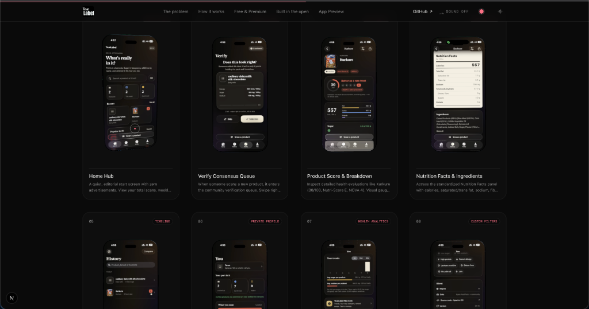
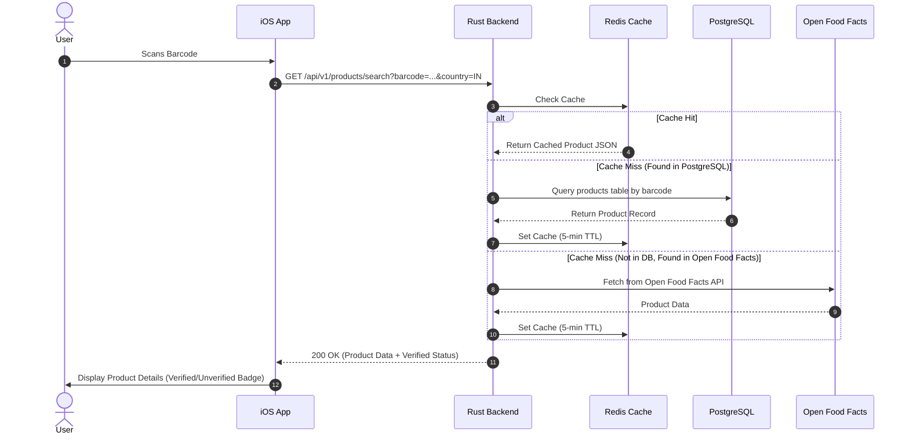
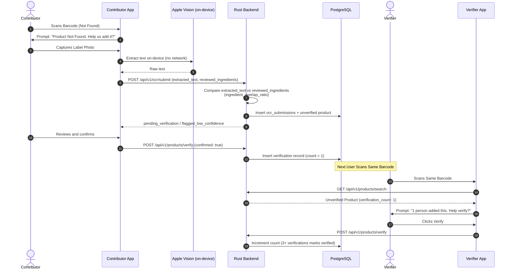

# TrueLabel 🏷️

> **Open-source barcode scanner with a crowdsourced, community-verified nutrition database.**

TrueLabel empowers consumers to scan barcodes, instantly retrieve accurate food and nutrition facts, and crowdsource missing or unverified food labels using on-device OCR and peer verification.

<p align="center">
  
</p>

> **📚 Full developer documentation, with search:** the details below get you
> running locally; anything deeper — the complete API reference, the iOS
> app's architecture, deployment internals — lives at
> [`web/apps/docs`](web/apps/docs) (`bun run dev --filter=docs`, or wherever
> it's deployed). This README stays a fast-orientation doc on purpose.

---

## 📑 Table of Contents

1. [Local Development Setup](#-local-development-setup)
   - [Prerequisites](#prerequisites)
   - [Backend](#backend)
   - [iOS App](#ios-app)
   - [Web Apps](#web-apps)
2. [Project Status](#-project-status)
3. [System Architecture](#-system-architecture)
   - [High-Level Diagram](#high-level-diagram)
   - [Data Flow: Successful Barcode Scan](#data-flow-successful-barcode-scan)
   - [Data Flow: Product Not Found (Crowdsourced Flow)](#data-flow-product-not-found-crowdsourced-flow)
4. [Database Schema](#-database-schema)
5. [API Contract](#-api-contract)
6. [Project Structure](#-project-structure)
7. [Architectural Decisions (ADRs)](#-architectural-decisions-adrs)
8. [Data Quality & Verification Strategy](#-data-quality--verification-strategy)
9. [Deployment](#-deployment)
10. [Monitoring & Analytics](#-monitoring--analytics)
11. [Testing Strategy](#-testing-strategy)
12. [Contributing](#-contributing)
13. [License](#-license)

---

## 🛠️ Local Development Setup

Each app is independent — you don't need all three running to work on one.
For the full walkthrough with more detail, see the
[Getting Started](web/apps/docs/content/docs/getting-started.mdx) doc.

> **`backend/` and `ios/truelable/` are git submodules** — a plain
> `git clone` leaves both empty. Use
> `git clone --recurse-submodules <this-repo>`, or after a plain clone,
> `git submodule update --init --recursive`. Changing code in either means
> committing in that submodule's own repo
> ([true-label-backend](https://github.com/TarunVishwakarma1/true-label-backend),
> [true-label-ios](https://github.com/TarunVishwakarma1/true-label-ios))
> first, then committing the updated pointer here.

### Prerequisites

- **Backend**: Rust stable (`rustup default stable`), Docker (or native Postgres 17 + Redis 7)
- **iOS**: Xcode 26+ (iOS 26.5 SDK)
- **Web**: [bun](https://bun.sh) 1.3.8, Node 24+

### Backend

```bash
docker compose up -d postgres redis      # from the repo root
cd backend
cp .env.example .env                     # defaults already match the compose services
cargo run                                # migrations run automatically on boot
curl http://localhost:8080/health/ready
```

Run tests with `cargo test`. See [Environment Variables](web/apps/docs/content/docs/backend/index.mdx)
for what every `.env` value does — `TRUSTED_PROXY_HOPS` and
`ALLOWED_ORIGINS` only matter once this runs behind a real reverse proxy,
not for local dev.

### iOS App

```bash
cd ios/truelable
open truelable.xcodeproj    # scheme: truelable
```

Point `APIEnvironment` at a running backend via the `API_BASE_URL` scheme
environment variable if `localhost:8080` isn't reachable (e.g. testing on a
physical device).

> To just verify a change compiles and its tests pass, prefer
> `xcodebuild -scheme truelable -destination 'platform=iOS Simulator,name=<device>' build-for-testing`
> over actually launching the Simulator — much faster when you don't need
> to see the UI.

### Web Apps

```bash
cd web
bun install
bun run dev             # marketing :3000, docs :3001, dashboard :3002, in parallel
```

The dashboard (`apps/dashboard` — crash reports, team, resources) additionally
needs its own `.env` (`cp apps/dashboard/.env.example apps/dashboard/.env`):
it reads the same Postgres database as the backend via Prisma for local
tooling, but **migrations stay owned by `backend/migrations/`** — never run
`prisma migrate` against it.

---

## 📌 Project Status

Past the MVP stage described in earlier planning docs — the backend has a
full product-lookup/search/trending/verification API, device-token auth
with optional Sign in with Apple, Redis-backed rate limiting, and OCR
submission; the iOS app is a full SwiftUI rewrite (scan, verify, history,
profile, TrueLabel Plus) that now also reports its own crashes via
MetricKit; and `web/apps/dashboard` gives staff a place to triage those
reports, manage who has dashboard access, and publish a report straight to
a GitHub issue. See the [docs site](web/apps/docs) for the current
architecture in depth rather than a sprint-by-sprint history here.

---

## 🏛️ System Architecture

### High-Level Diagram

```markdown
┌─────────────────────────────────────────────────────────────┐
│                    iOS App (SwiftUI)                        │
│  ┌──────────────────────────────────────────────────────┐  │
│  │ • Barcode Scanner (DataScannerViewController)         │  │
│  │ • On-device OCR of labels (Apple Vision, no network)  │  │
│  │ • Local history + preferences (SwiftData)             │  │
│  │ • Device token in Keychain                            │  │
│  └──────────────────┬───────────────────────────────────┘  │
└─────────────────────┼──────────────────────────────────────┘
                      │ HTTPS (REST API, Bearer token)
                      ▼
            ┌──────────────────────┐
            │  Rust Backend API    │
            │  (Axum / Tokio)      │
            │  behind nginx (TLS)  │
            └──────────┬───────────┘
               │
    ┌──────────┼──────────┬─────────────┐
    │          │          │             │
    ▼          ▼          ▼             ▼
┌─────────┐ ┌──────┐ ┌──────────┐ ┌─────────┐
│ Redis   │ │  DB  │ │  Open    │ │  Apple  │
│(rate    │ │Post- │ │  Food    │ │ (Sign   │
│ limits) │ │ gres │ │  Facts   │ │ in w/   │
│         │ │      │ │          │ │ Apple)  │
└─────────┘ └──────┘ └──────────┘ └─────────┘
```

No image storage exists anywhere in this system — OCR happens entirely
on-device, and only the extracted text (not the photo) is ever sent to the
backend.

---

### Data Flow: Successful Barcode Scan



---

### Data Flow: Product Not Found (Crowdsourced Flow)



---

## 🗄️ Database Schema

Migrations run automatically at boot (`db::run_migrations`), in
`backend/migrations/`. This is the schema they actually produce.

```markdown
┌────────────────────────────────────────────┐      ┌──────────────────────────────────────┐
│                  products                  │      │            verifications             │
├────────────────────────────────────────────┤      ├──────────────────────────────────────┤
│ id                UUID PK                  │◀──┐  │ id           UUID PK                 │
│ barcode           VARCHAR(20) UNIQUE       │   └──│ product_id   UUID FK → products(id)  │
│ country           VARCHAR(2)               │      │ barcode      VARCHAR(20)             │
│ product_name      VARCHAR(255)             │      │ country      VARCHAR(2)              │
│ brand             VARCHAR(255)             │      │ device_id    VARCHAR(255)            │
│ image_url         TEXT                     │      │ verified     BOOLEAN NOT NULL        │
│ nutrition_facts   JSONB NOT NULL           │      │ created_at   TIMESTAMPTZ             │
│ ingredients       TEXT                     │      └──────────────────────────────────────┘
│ allergens         TEXT                     │
│ source            VARCHAR(50)              │      ┌──────────────────────────────────────┐
│ verified          BOOLEAN  DEFAULT FALSE   │      │           ocr_submissions            │
│ verification_count INT     DEFAULT 0       │      ├──────────────────────────────────────┤
│ confidence_score  FLOAT                    │      │ id               UUID PK             │
│ additives         JSONB                    │      │ barcode          VARCHAR(20)         │
│ nova_group        SMALLINT                 │      │ country          VARCHAR(2)          │
│ nutriscore_grade  VARCHAR(1)               │      │ image_url        TEXT (nullable)     │
│ is_vegan          BOOLEAN (tri-state)      │      │ extracted_text   TEXT NOT NULL       │
│ is_vegetarian     BOOLEAN (tri-state)      │      │ parsed_nutrition JSONB               │
│ is_palm_oil_free  BOOLEAN (tri-state)      │      │ confidence_score FLOAT               │
│ category          TEXT                     │      │ status           VARCHAR(50)         │
│ lookup_count      INT NOT NULL DEFAULT 0   │
│ off_synced_at     TIMESTAMPTZ              │
│ off_last_modified BIGINT                   │      │ created_at       TIMESTAMPTZ         │
│ created_at        TIMESTAMPTZ              │      │ updated_at       TIMESTAMPTZ         │
│ updated_at        TIMESTAMPTZ              │◀─────│ final_product_id UUID FK (nullable)  │
└────────────────────────────────────────────┘      └──────────────────────────────────────┘
```

A fourth table, `users`, is one row per device — `device_id` (the primary
key), `country`, `dietary_preferences` (a JSONB array), `token_hash` /
`token_issued_at` (SHA-256 of the bearer token, never the token itself), the
three Plus columns `plus_since` / `plus_expires_at` / `plus_source`, and the
optional Sign-in-with-Apple linkage: `apple_user_id`, `email`,
`display_name`, `linked_at`. A device row exists from first launch with all
of those Apple/email columns `NULL`; linking an Apple ID later fills them in
without changing `device_id` — the device stays the primary identity, the
Apple account is just attached to it.

Notes that matter when querying:

- **`nutrition_facts`** always carries the same thirteen keys — `energy_kcal`,
  `protein`, `carbs`, `fat`, `saturated_fat`, `trans_fat`, `fiber`, `sugar`,
  `sodium`, `cholesterol`, `potassium`, `calcium`, `iron` — per 100 g, with
  `sodium` in grams. A key we could not find is stored as `null` rather than
  omitted, so a client can tell "Open Food Facts doesn't publish this" from
  "we failed to map it". A user-contributed product with no nutrition table
  stores `{}`.
- **`off_synced_at` / `off_last_modified`** are how far behind Open Food Facts
  this row is: when we last brought it in step, and their own last-edited
  stamp at that moment. `NULL` on rows we sourced ourselves.
- **`additives`** is a JSON array of E-numbers (`["E150D","E338"]`). `NULL`
  means "the source has no additive data", which is not the same claim as
  "no additives".
- **`is_vegan` / `is_vegetarian` / `is_palm_oil_free`** are genuinely
  three-valued. `NULL` is "unknown" and must never be collapsed to `false`.
- **`category`** is Open Food Facts' most specific `categories_tags` entry
  (`"fruit-nectars"`). It is what same-shelf alternatives match on; rows
  without one are excluded from that feature rather than matched loosely.
- **`lookup_count`** increments on every resolved look-up, asynchronously so
  it never sits on the scan path. It ranks `/products/trending` and breaks
  ties in search.

Two more tables back the dashboard (`web/apps/dashboard`), a deliberately
separate identity system from `users` above — a bug in one can never leak
into the other's authority. `dashboard_users` is one row per staff account
(name, email, `occupation`, Argon2 `password_hash`, `role` — `admin` or
`member` — plus the same bearer-token-hash session mechanics as device
auth). `crash_reports` holds what the dashboard triages: `platform`,
`title`, `stack_trace`, a JIRA-shaped `status` funnel (`submitted` →
`pending` → `in_review` → `in_progress` → `done`, or `wont_fix`),
`source` (`app` — iOS's own `CrashReporter` via MetricKit — or `manual`),
and `github_issue_url` once published. Full column lists are on the
[docs site](web/apps/docs/content/docs/backend/database-schema.mdx).

### Indices

```sql
-- products
CREATE INDEX idx_products_barcode            ON products(barcode);
CREATE INDEX idx_products_barcode_country    ON products(barcode, country);
CREATE INDEX idx_products_verified           ON products(verified);
CREATE INDEX idx_products_category_country   ON products(category, country);
CREATE INDEX idx_products_country_popularity ON products(country, lookup_count DESC);
CREATE INDEX idx_products_name_trgm          ON products USING gin (product_name gin_trgm_ops);
CREATE INDEX idx_products_brand_trgm         ON products USING gin (brand gin_trgm_ops);

-- verifications
CREATE INDEX idx_verifications_product_id       ON verifications(product_id);
CREATE INDEX idx_verifications_barcode_country  ON verifications(barcode, country);

-- ocr_submissions
CREATE INDEX idx_ocr_submissions_barcode ON ocr_submissions(barcode);
CREATE INDEX idx_ocr_submissions_status  ON ocr_submissions(status);
```

The two GIN indices need the `pg_trgm` extension, which the search migration
creates (`CREATE EXTENSION IF NOT EXISTS pg_trgm`). On a managed Postgres the
role running migrations must be allowed to create extensions; every major
provider ships `pg_trgm` on its allowed list.

---

## 📡 API Contract

### Authentication

There are no accounts, so a **device** is the subject. It proves itself with
a bearer token, not with its identifier:

```markdown
POST /api/v1/auth/device        (no body, no auth)
→ { "device_id": "…", "token": "…" }
```

The token is issued once per install and returned once. Only its SHA-256 is
stored, so a database leak does not hand over credentials. Every per-user
endpoint then takes it:

```markdown
Authorization: Bearer <token>
```

**The device id never appears in a path or query again.** It previously did,
which meant anyone holding one could read that person's profile, cancel their
Plus, or delete their account — and a device identifier is not a secret: iOS
hands the same one to every app from a vendor, and anything in a URL lands in
proxy and access logs. The token is the identity, so a caller has no way to
name anybody but itself. The server, not the client, generates the id, so
there is nothing to guess or claim.

On the client the token lives in the **Keychain**, which survives deleting the
app — that is what lets a reinstall keep its profile. A `401` means the row
behind the token is gone; the client registers afresh and retries once.

| Endpoint | Auth |
| --- | --- |
| `/health*`, `/products/search`, `/query`, `/trending`, `/alternatives`, `/crash-reports` (submit) | none |
| `/products/needs-verification` | optional — a token lets it skip what you already voted on |
| `/products/verify`, `/ocr/submit`, all of `/me/*` | **required** |

**`/admin/*` is a second, separate auth system** — bearer tokens for
`dashboard_users` (named staff accounts with a password), not devices. It
backs `web/apps/dashboard`, not the iOS app: `POST /admin/auth/register` /
`login` mint the same shape of token via the same hash-only-stored
mechanics as device auth, and the resulting token gates
`/admin/crash-reports/*` (reading/triaging reports is any signed-in staff
account; publishing one to GitHub is gated to the `admin` role) and
`/admin/team/*` (viewing the team is any staff account; changing a role is
`admin`-only, and the last admin can't demote themselves). Full contract
on the [docs site](web/apps/docs/content/docs/backend/api-reference).

### Transport and browser posture

Every response carries `Cache-Control: no-store`, `X-Content-Type-Options`,
`X-Frame-Options: DENY`, `Content-Security-Policy: default-src 'none'`,
`Referrer-Policy: no-referrer` and HSTS. These are set on the router, not per
route, so an endpoint added tomorrow is covered without anyone remembering.
`no-store` is the one that matters most: an authenticated reply carries a
profile and a subscription state, and without it a shared proxy may keep a
copy and hand it to the next person through.

**CORS is closed by default.** `ALLOWED_ORIGINS` is an explicit allowlist and
starts empty. A native client sends no `Origin`, so an empty list costs the
app nothing and stops the API being used as somebody else's free backend.
Credentials are never allowed and never needed.

**CSRF does not apply here, structurally rather than by mitigation.** This API
authenticates with an `Authorization` header, which a browser never attaches
on its own, and it sets no cookies. There is no ambient authority for a
cross-site request to borrow. That property is worth protecting: the moment a
cookie carries auth, every state-changing route needs a token of its own.

**Requests time out at 25 seconds**, longer than any call this service makes
outward, so a request can only expire here once its own dependencies already
have. Calls to Open Food Facts carry their own 10-second ceiling. Without
these a hung connection holds a worker and a database handle indefinitely,
which is how a slow client takes a service down with no volume at all.

### Rate limits

Per hour, counted in Redis. The subject is the **token** when there is one and
the **address** otherwise, because mobile networks put thousands of people
behind one address and limiting everybody by IP would punish a whole carrier
for one script.

| Bucket | Limit | Subject |
| --- | --- | --- |
| Barcode look-up | 600 | device or address |
| Text search | 200 | device or address |
| Confirm a label | 60 | device |
| Add a product | 20 | device |
| Profile / subscription / link writes | 60 | device |
| Register a device | 10 | address |

Over the limit returns `429`. The counter is a fixed window incremented and
expired in one Lua call, so a process dying mid-sequence cannot leave a key
without a TTL and jam a subject out permanently. It **fails open**: if Redis
is unreachable the request is allowed and the failure is logged, because this
limiter exists to blunt abuse and taking the API down when the cache blinks is
the worse outcome.

**`X-Forwarded-For` needs a hop count, not a boolean.** It is a list each
proxy appends to, so everything left of what *your own* proxies added is
written by the caller. Reading the leftmost entry — the obvious thing — means
a client sends `X-Forwarded-For: <anything>` and picks a fresh rate-limit
bucket on every request.

`TRUSTED_PROXY_HOPS` is the number of proxies in front of this process, and
the client is the entry that many places from the right: the address the
outermost trusted proxy actually observed. It defaults to `0`, which ignores
the header and uses the socket's peer address, which no caller can forge.

Count only hops that append to the header. `ingress-nginx` alone is `1`; a CDN
in front of it makes `2`; an L4 load balancer does not append and does not
count. **Setting it higher than the truth is worse than leaving it at zero**,
because the surplus entries are the caller's.

A global backstop of 3,000 requests per hour per address covers every route,
including ones added later, so a flood at an endpoint nobody remembered to
protect still costs something. Health checks are exempt: limiting them would
pull the service out of rotation under exactly the load the limit exists for.

**On DDoS, plainly.** Application code cannot absorb a volumetric attack. What
it can do is refuse to amplify, bound the work any one caller can cause, fail
fast, and never exhaust its own resources — all of which is above. Absorbing
volume is the edge's job: the ingress carries connection and request-rate
caps and short client timeouts, and anything serious needs a CDN or scrubbing
provider in front of the cluster.

Postgres and Redis are closed to everything but the backend by NetworkPolicy.
They hold every product row, profile and token hash, and neither speaks TLS
inside the cluster, so a compromised sidecar reaching them directly is the
failure worth preventing.

Request bodies are capped at 256 KB, and an OCR submission at 20,000
characters of recognised text.

Every response is wrapped in the same envelope:

```json
{ "status": "success", "data": { }, "cached": false, "timestamp": "2026-09-13T10:00:00Z" }
```

Errors reply `{ "status": "error", "error": "...", "timestamp": "..." }` with a
`400` (bad barcode/country/query), `404` (product not in the catalogue),
`502` (Open Food Facts unreachable) or `500`.

`country` is a 2-letter code everywhere and defaults to `IN`.

---

### 1. Look up a product by barcode

`GET /api/v1/products/search?barcode=<8–14 digits>&country=IN`

Resolution order is Redis (1 hour TTL) → Postgres → Open Food Facts (rate
limited to 12 req/min across the whole service). A product fetched from Open
Food Facts is written to Postgres before it is returned, so the second
look-up is local. A barcode Open Food Facts doesn't have either is remembered
as a miss for 10 minutes, so re-scanning an unknown pack doesn't spend the
shared budget. Each resolved look-up increments `products.lookup_count`,
which is what `/trending` ranks on.

**Staying in step with Open Food Facts.** Our row is a cache of theirs, not a
fork of it, and two things keep it honest:

- *One mapping.* Every column we take from a product is produced by a single
  `OffFields::from`, used by the first insert and by every later refresh.
  Nutrients go through one table that reads `<nutrient>_100g` first, then the
  bare key, then `_value`. Every figure this API publishes is per 100 g, so
  only `_100g` may be trusted — the bare key is historical, is not guaranteed
  to be normalised, and is often absent entirely.
- *Refresh on read.* A read of an Open-Food-Facts-sourced row whose
  `off_synced_at` is more than 30 days old kicks off a background refresh.
  It is opportunistic: if the per-minute budget has no free slot it gives up
  rather than queue, because a refresh is never the urgent request and a live
  scan is. The reader is served the existing row either way.

A refresh rewrites only the columns Open Food Facts owns. `verified`,
`verification_count` and `lookup_count` are ours and are never overwritten,
and a `user_contributed` row is never touched at all. `off_last_modified`
records their own last-edited stamp at the moment we synced, so "are we in
step with them" is answerable without re-reading the product.

```json
{
  "status": "success",
  "cached": false,
  "data": {
    "id": "b18b6250-9d04-4cc4-9c09-a1b9ceec848a",
    "barcode": "8901030895564",
    "country": "IN",
    "product_name": "Aloo Bhujia",
    "brand": "Haldiram's",
    "image_url": "https://images.openfoodfacts.org/…/front.jpg",
    "nutrition_facts": {
      "energy_kcal": 546, "protein": 9.2, "carbs": 43.8, "fat": 36.4,
      "saturated_fat": 12.1, "trans_fat": 0, "fiber": 3,
      "sugar": 2.4, "sodium": 1.18, "cholesterol": null,
      "potassium": null, "calcium": null, "iron": null
    },
    "nutrition_per_serving": { "energy_kcal": 163.8, "sugar": 0.72, "…": null },
    "nutrient_levels": { "fat": "high", "saturated_fat": "high", "sugar": "low", "sodium": "high" },
    "serving_size": "30 g",
    "serving_quantity": 30,
    "quantity": "200 g",
    "ingredients": "Gram flour, edible vegetable oil (palm), potato, salt…",
    "allergens": ["peanuts"],
    "traces": ["tree-nuts"],
    "labels": ["vegetarian", "no-added-sugar"],
    "additives": ["E330", "E500II"],
    "categories": ["snacks", "salty-snacks", "namkeen"],
    "source": "open_food_facts",
    "verified": false,
    "verification_count": 1,
    "off_synced_at": "2026-09-13T10:00:00Z",
    "completeness": 0.85,
    "nova_group": 4,
    "nutriscore_grade": "d",
    "nutriscore_score": 18,
    "ecoscore_grade": "d",
    "is_vegan": true,
    "is_vegetarian": true,
    "is_palm_oil_free": false,
    "category": "namkeen"
  }
}
```

Everything in `nutrition_facts` is **per 100 g**, and `sodium` is in **grams**
(Open Food Facts' convention), not milligrams. `nutrition_per_serving` is the
same document scaled by `serving_quantity` — arithmetic only, and absent
rather than guessed when the pack states no serving size.

`nutrient_levels` is `low` / `moderate` / `high` per nutrient. It is Open
Food Facts' own where they publish one, and the UK FSA front-of-pack
thresholds where they do not — with the separate drinks thresholds applied
when the product is a beverage, because 12 g of sugar is moderate in a
biscuit and high in a bottle.

**Three-valued fields, throughout.** The dietary flags, `allergens`,
`traces`, `labels`, `additives` and `categories` are all `null` when the
source publishes nothing and `[]` / `false` when it publishes "none". Those
are different claims to make about food and must never be collapsed.
`traces` is the "may contain" line and is kept apart from `allergens` on
purpose: a trace is not an ingredient, and for an allergy it is often the
line that decides it.

Tags travel as **slugs with the locale prefix stripped** — `"tree-nuts"`,
not `"en:tree-nuts"` and not `"Tree Nuts"`. A slug can be both matched on and
prettified; a display string can only be shown.

Nutrient figures are sanity-checked before storage: anything negative, or
above 100 g per 100 g, or above 900 kcal per 100 g, is dropped rather than
stored. Open Food Facts is crowd-edited and does contain data-entry errors,
and rendering one is worse than rendering nothing.

---

### 2. Search products by name or brand

`GET /api/v1/products/query?q=<2–60 chars>&country=IN&limit=20`

Local catalogue first, ranked by trigram similarity against `product_name`
and `brand` then by popularity. When fewer than five local rows match, the
list is topped up from Open Food Facts' search endpoint, which runs on its
own 8 req/min budget and is **skipped rather than queued** when that budget is
spent — a thin result beats a slow one. Results are cached for 10 minutes.

Returns an array of product cards:

```json
{
  "status": "success",
  "cached": false,
  "data": [
    {
      "barcode": "8901030895564",
      "product_name": "Aloo Bhujia",
      "brand": "Haldiram's",
      "image_url": "https://…/front.jpg",
      "nutriscore_grade": "d",
      "nova_group": 4,
      "verified": false,
      "energy_kcal": 546,
      "sugar": 2.4,
      "sodium": 1.18
    }
  ]
}
```

---

### 3. Trending products

`GET /api/v1/products/trending?country=IN&limit=10`

The same card shape, ordered by `lookup_count`, then verification count, then
recency — so a freshly seeded database still returns something rather than an
empty list. Products still named `Unknown` are excluded.

---

### 4. Same-shelf alternatives

`GET /api/v1/products/alternatives?barcode=…&country=IN&sort_by=sugar&limit=3`

Products sharing the scanned product's `category`, ranked on one nutrient.
`sort_by` accepts `sugar`, `sodium`, `fat`, `saturated_fat`, `energy_kcal`,
`carbs` (ascending — less is better), `protein`, `fiber` (descending — more is
better), or `score` (Nutri-Score then NOVA). `limit` is clamped to 1–10.

Returns product cards with an extra `sort_value` (the ranked nutrient's per-100 g
figure). A product with no `category` returns `[]` — an unmatched shelf beats a
wrong one.

---

### 5. Verification queue

`GET /api/v1/products/needs-verification?country=IN&limit=12`

Products below the 3-confirmation threshold that this device hasn't already
voted on. Works without a token; sending one is what lets it skip what you
have already voted on.

```json
{
  "status": "success",
  "data": [
    {
      "barcode": "8901030895564",
      "product_name": "Aloo Bhujia",
      "brand": "Haldiram's",
      "image_url": "https://…/front.jpg",
      "nutriscore_grade": "d",
      "energy_kcal": 546,
      "sugar": 2.4,
      "sodium": 1.18,
      "verification_count": 1
    }
  ]
}
```

---

### 6. Confirm a product matches its label

`POST /api/v1/products/verify`

```json
{ "barcode": "8901030895564", "country": "IN" }
```

Who is confirming comes from the token, never from the body.

Records a row in `verifications`, increments `products.verification_count`,
flips `verified` to true at 3, busts the product's cache entry, and returns the
refreshed product in the standard envelope.

---

### 7. Profile

`GET /api/v1/me/profile`

There are no accounts. `identifierForVendor` is the identity, and **reading a
profile creates it**, so the client never needs a registration step. `country`
seeds the row on first read and is ignored afterwards.

```json
{
  "status": "success",
  "data": {
    "device_id": "9B1D6F20-80E2-47DB-9D9B-FDF6ECFA8B85",
    "country": "IN",
    "dietary_preferences": ["Vegetarian", "Low sugar"],
    "subscription": { "tier": "plus", "active": true, "since": "2026-09-13T10:00:00Z", "expires_at": null, "source": "complimentary" },
    "created_at": "2026-09-13T09:12:00Z"
  }
}
```

`PUT /api/v1/me/profile`

```json
{ "country": "IN", "dietary_preferences": ["Vegetarian", "Low sugar"], "display_name": "Tarun" }
```

`display_name` is settable here without an account — a name is not an
identity, and it is the only thing a client can offer when Sign in with Apple
is unavailable to it. An empty string clears it; absent leaves it alone.

Every field is optional — absent means "leave it alone", so country can
change without resending the preference list. The backend does not own the
preference vocabulary (the app does, and it grows), so entries are stored as
given, but trimmed, de-duplicated, and capped at 32 entries of 64 characters
so one client cannot write an unbounded blob into a shared table.

---

### 8. Contribution stats

`GET /api/v1/me/stats`

```json
{ "confirmations": 12, "contributions": 3, "helped_verify": 5, "member_since": "2026-09-13T09:12:00Z" }
```

Deliberately about **contribution, not consumption**. How much someone scans
never leaves their phone; what they put into the shared catalogue is the only
thing counted here. `helped_verify` is the subset of their confirmations that
sit on products which have since crossed the threshold and are now verified
for everyone — the number worth showing a person.

All three come back in one round trip, because three separate counts on a
profile screen is three chances to be half-loaded.

---

### 9. Subscription

`GET /api/v1/me/subscription`
`POST /api/v1/me/subscription` — activate
`DELETE /api/v1/me/subscription` — cancel

```json
{ "tier": "plus", "active": true, "since": "2026-09-13T10:00:00Z", "expires_at": null, "source": "complimentary" }
```

**TrueLabel Plus is free right now, and there is no payment step.** `POST`
takes no body: while Plus is complimentary, asking for it is the whole
transaction. It sets `since` and leaves `expires_at` as `null`, which means
*on, with no expiry* — `active` must never be computed in a way that reads a
missing expiry as lapsed.

`source` records how the tier was granted, `"complimentary"` today and
`"paid"` once payments exist. When they do, `POST` takes a receipt, verifies
it, and writes a real `expires_at`; the response shape does not change, so
clients written against this contract keep working.

The iOS client treats either the backend or a StoreKit entitlement as
sufficient for Plus, so that switch needs no client change either.

---

### 10. Sign in, sign out, delete

> **Sign in with Apple needs a paid Apple Developer Program team.** A personal
> team cannot create a provisioning profile that declares the entitlement, so
> signing fails outright rather than degrading. The iOS build therefore ships
> with the capability off (`Capabilities.signInWithApple = false`, and no
> `CODE_SIGN_ENTITLEMENTS` on the target) and the account page falls back to a
> display name the person chooses, set through the profile endpoint. **The
> backend below is live either way** — it verifies identity tokens as soon as
> a build starts sending them, so enabling the capability is a client-only
> change. See `truelable.entitlements` for the two switches.

`POST /api/v1/me/link`

```json
{ "identity_token": "<Apple identity token>", "display_name": "Tarun Vishwakarma" }
```

Sign in with Apple is the only provider, so there are no passwords stored and
no email to deliver. The token is verified end to end before anything is
written — Apple's signature over Apple's published key, issued by Apple, with
this app's bundle id as audience, unexpired. This endpoint is otherwise
unauthenticated, so an unverified token would let a caller claim any account.
Apple's keys are cached for six hours and re-fetched on an unknown key id.

`display_name` is optional and must be sent by the client: Apple hands the
name over on the **first authorization only** and never puts it in the token.
`email` likewise arrives once, and the user may hide it, so both are stored
with `COALESCE` and never blanked by a later sign-in.

If that Apple identity already owns a row on another device, the account
**moves**: Plus state and preferences come across, the old row is deleted, and
that phone reverts to anonymous. One active device per account. There is no
cross-device sync, so anything else would silently duplicate an entitlement.

`POST /api/v1/me/unlink` detaches the identity and keeps the
row, which is what signing out should do — the app keeps working and nothing
is destroyed.

`DELETE /api/v1/me/account` deletes the account for real, not a
deactivation flag. The App Store requires any app that creates accounts to
offer this from inside the app. Verifications the device submitted are left
alone: they carry no identity beyond a device id, and removing them would
silently unverify products other people rely on.

The profile response carries an `identity` block alongside `subscription`:

```json
"identity": { "signed_in": true, "provider": "apple", "email": null, "display_name": "Tarun", "linked_at": "2026-09-13T10:00:00Z" }
```

`signed_in: false` is the normal state. Nothing in the app requires an account.

---

### 11. Submit a label read on-device

`POST /api/v1/ocr/submit`

The client runs OCR itself (Vision framework, live multi-frame) and sends the
untouched recognized text alongside what the user confirmed after reviewing it.

```json
{
  "barcode": "8901030895564",
  "country": "IN",
  "extracted_text": "HALDIRAM'S\nAloo Bhujia\nIngredients: Gram flour…",
  "reviewed_ingredients": "Gram flour, Palm oil, Salt",
  "reviewed_allergens": ["Peanut"],
  "product_name": "Aloo Bhujia",
  "brand": "Haldiram's",
  "nutrition": { "energy_kcal": 546, "fat": 36.4, "sugar": 2.4, "sodium": 1.18 }
}
```

The contribution is attributed to the token's device, so it can be counted
back on the profile screen. `product_name`, `brand` and `nutrition` are optional — older clients send only
the ingredient side. `extracted_text` is kept as the audit trail: the server
re-parses it and compares against the reviewed fields, so a submission that
silently drops an allergen OCR clearly found is stored
`flagged_allergen_mismatch`, and one whose ingredients were wholesale replaced
is stored `flagged_low_confidence`. `nutrition` is filtered to the thirteen
known keys with finite values in `0…1000` before anything is written.

A successful submission also inserts the product itself (`source:
"user_contributed"`, `verified: false`) with `ON CONFLICT (barcode) DO NOTHING`,
so the barcode is searchable immediately without unverified data ever
clobbering an existing row.

---

## 📂 Project Structure

```markdown
true-lable/
├── backend/                        # Rust backend (Axum + Tokio) — git submodule, own repo
│   ├── Cargo.toml
│   ├── .env.example
│   ├── migrations/                 # SQLx migrations, run automatically at boot
│   └── src/
│       ├── main.rs                 # Entrypoint & graceful shutdown
│       ├── lib.rs                  # App assembler
│       ├── auth.rs                 # Device tokens (Device) & dashboard sessions (AdminUser)
│       ├── config/env.rs           # Typed config, credential masking
│       ├── db/{postgres,redis}.rs
│       ├── error.rs                # AppError → HTTP status mapping
│       ├── state.rs                # AppState (PgPool, Redis, Config)
│       ├── middleware/             # logging, error_handler
│       ├── routes/
│       │   ├── health.rs
│       │   └── v1/{products,ocr,me,admin,crash_reports}.rs
│       ├── handlers/{products,ocr,users,admin_auth,crash_reports}.rs
│       ├── services/
│       │   ├── product_service.rs
│       │   ├── ocr_service.rs      # ingredient_overlap_ratio confidence check
│       │   ├── openfoodfacts.rs
│       │   ├── cache_service.rs
│       │   ├── user_service.rs
│       │   ├── apple_auth.rs       # Sign in with Apple JWT verification
│       │   ├── admin_service.rs    # Dashboard staff accounts, team, roles
│       │   ├── crash_report_service.rs
│       │   └── github_service.rs   # "Publish to GitHub" issue creation
│       └── models/{product,ocr,user,verification,response,admin,crash_report}.rs
├── ios/truelable/                  # iOS app (SwiftUI, iOS 26+) — git submodule, own repo
│   └── truelable/
│   ├── App/                        # TrueLabelApp, RootView, AppRouter
│   ├── Core/                       # APIClient, DeviceAuth, Account, Preferences, Plus, CrashReporter
│   ├── Design/                     # Theme.swift (enum TL), Components.swift
│   ├── Features/
│   │   ├── Home/ Onboarding/ Scan/ Product/ History/
│   │   └── Verify/ Profile/ Account/ Plus/ Contribute/ Search/
│   └── PrivacyInfo.xcprivacy       # Required Reason API declarations (UserDefaults)
├── web/                             # Turborepo (bun workspaces)
│   ├── apps/web/                   # Marketing site (Next.js)
│   ├── apps/docs/                  # Developer docs (Fumadocs)
│   ├── apps/dashboard/             # Internal admin dashboard — crash reports, team, resources
│   └── packages/{ui,eslint-config,typescript-config}/
├── deploy/                          # Single-VM deploy (EC2 or DO droplet) — the low-cost path
├── .github/                          # Issue/PR templates, CI/CD (builds + deploys to DOKS)
├── k8s/                              # Kustomize base + overlays — real production deployment
├── infra/digitalocean/               # Terraform for the DOKS cluster itself
└── README.md
```

---

## ⚖️ Architectural Decisions (ADRs)

| Component | Choice | Rationale | Alternatives Considered |
| --- | --- | --- | --- |
| **Database** | **PostgreSQL** | Relational integrity, JSONB support for variable nutrition tables, `pg_trgm` for search. | *Redis-only* (no persistence), *CockroachDB* (overkill). |
| **Cache** | **Redis** | Product lookup cache + rate-limit counters, sub-5ms. | *In-memory LRU* (doesn't scale across replicas). |
| **OCR** | **On-device Apple Vision** (`DataScannerViewController`, text mode) | No photo ever leaves the device, zero OCR API cost, no image-storage requirement. Confidence comes from server-side `ingredient_overlap_ratio` against reviewed text, not a vendor score. | *Cloud OCR (Google/AWS Vision)* — rejected: recurring cost, requires image upload/storage, adds a network round-trip to every contribution. |
| **Auth** | **Device bearer token** (+ optional Sign in with Apple) | No password to leak; only `SHA-256(token)` is stored; device id never appears in a URL. | *Full account system* — deferred; Apple Sign-In is implemented server-side but off client-side pending a paid Apple Developer team. |
| **Backend Framework** | **Rust (Axum + Tokio)** | Memory safety, low resource footprint, strong async ecosystem. | *Actix-web*, *Go/Gin*, *Node.js*. |
| **Production hosting** | **DigitalOcean Kubernetes (DOKS)**, or a single EC2/droplet VM (`deploy/`) for lower cost | k8s: one ingress + one DO Load Balancer routes 4 subdomains to 4 apps. VM: one binary behind nginx behind systemd, provider-agnostic. Both read the same `DATABASE_URL`/`REDIS_URL` (Neon/Upstash) — nothing about the app changes between them, only how much it costs and scales. | *AWS EKS* — was built out (`infra/aws/`) but never deployed to; kept as reference only. |

---

## 🛡️ Data Quality & Verification Strategy

```markdown
        ┌────────────────────────────┐
        │ User captures label photo  │
        └─────────────┬──────────────┘
                       ▼
        ┌────────────────────────────┐
        │ On-device Apple Vision OCR │   (no network call, no image sent)
        └─────────────┬──────────────┘
                       ▼
   Backend compares extracted_text vs. reviewed_ingredients
              (ingredient_overlap_ratio)
                       │
        ┌──────────────┼───────────────┐
        ▼              ▼               ▼
   pending_       flagged_low_    flagged_allergen_
 verification      confidence         mismatch
        │
        ▼
  Stored as unverified (verification_count = 1)
        │
  ┌─────┴─────┐
  ▼           ▼
Count < 3   Count ≥ 3
"Unverified" "Verified" (green checkmark)
```

1. **Verification thresholds**: `0–2` verifications shows an "Unverified — X people added this" badge; `≥ 3` flips `verified` to `true`.
2. **Confidence**: not a vendor OCR score — the backend measures how much of the client's raw scanned text overlaps the ingredient list the user actually submitted (`ocr_service.rs`), flagging low overlap or an allergen appearing in the text but not the reviewed list.
3. **Open Food Facts rows** go through a separate honesty check (see [Database Schema](#-database-schema) → *Staying in step with Open Food Facts*) rather than the peer-verification counter, since those rows didn't come from a user submission.

---

## 🚀 Deployment & Infrastructure

Two deployment paths exist, both reading the exact same
`DATABASE_URL`/`REDIS_URL` — pick based on scale, not because the app
changes between them.

### Kubernetes (DigitalOcean, `k8s/` + `infra/digitalocean/`)

One ingress (ingress-nginx, one DO Load Balancer) routes four hostnames to
four Deployments; cert-manager keeps all four on Let's Encrypt TLS:

```
truelabel.fun            → web        (marketing)
api.truelabel.fun        → backend
dashboard.truelabel.fun  → dashboard
docs.truelabel.fun       → docs
```

Postgres and Redis are **not** in the cluster — [Neon](https://neon.tech)
and [Upstash](https://upstash.com) instead, reached over the network like
any other dependency the app has. The backend only ever reads
`DATABASE_URL`/`REDIS_URL`, so a future move to self-hosted (bare metal, or
back in-cluster) is those two values changing, nothing else — the
excluded-but-not-deleted `k8s/base/postgres/` and `redis/` manifests are
kept around for exactly that day.

`git push origin main` builds and pushes all four images
(`.github/workflows/ci-cd.yml`), then deploys via `kubectl apply -k
k8s/overlays/main`. The full one-time cluster setup (Terraform, DNS,
cert-manager, GitHub secrets) is in
[Deployment](https://docs.truelabel.fun/docs/deployment) — worth reading
before touching any of this by hand.

The setting that matters most for correctness is `TRUSTED_PROXY_HOPS=1`
(`k8s/base/backend/configmap.yaml`) — ingress-nginx is the only proxy that
appends to `X-Forwarded-For` here (DO's Load Balancer is L4 and doesn't
touch HTTP headers), so rate limiting reads the real client IP rather than
a spoofable header or, worse, one shared bucket for the whole internet.

### Single VM — EC2 or a DO droplet (`deploy/`)

The low-cost alternative when traffic doesn't justify a cluster: one binary
behind nginx behind systemd, provider-agnostic (the same files work on
either EC2 or a droplet — only provisioning the VM itself differs). See
[`deploy/README.md`](deploy/README.md) for the full setup, including where
to get a TLS cert and the same `TRUSTED_PROXY_HOPS` reasoning as above,
adapted for nginx instead of ingress-nginx.

---

## 📊 Monitoring & Analytics

**Crash reporting is live**, self-built rather than a third-party SDK: iOS
crashes go through `MetricKit` — Apple's own safe capture mechanism, not a
hand-rolled signal handler — which hands `CrashReporter.swift` an
already-symbolicated diagnostic on a later launch (typically within a day,
the same cadence as Xcode Organizer's own crash reports). It POSTs to the
unauthenticated `POST /api/v1/crash-reports`, and staff triage the result
in `web/apps/dashboard` (status funnel, filters, search, and a one-click
"publish as GitHub issue" for anything that needs a real ticket). Staff can
also file a report by hand from the dashboard for anything with no
automated path yet — a TestFlight crash log, a user email.

Everything else here is still the plan, not current state:

- **Performance**: P95 API latency, Redis cache hit ratio, Open Food Facts failure rate.
- **Data quality**: verification-count distribution, `ingredient_overlap_ratio` distribution, flag rate.
- **Planned tools**: Sentry (errors beyond crashes), PostHog (product analytics), Prometheus + Grafana (container metrics). None are integrated yet — the only other present signal is structured request logging (`middleware/logging.rs`) and the `/health`, `/health/live`, `/health/ready` endpoints.

---

## 🧪 Testing Strategy

```bash
cd backend && cargo test    # unit tests: auth, rate limiting, subscription logic,
                             # nutrient parsing, error → status mapping
                             # + one full HTTP integration test via tower::ServiceExt::oneshot
```

```bash
xcodebuild -scheme truelable \
  -destination 'platform=iOS Simulator,name=<device>' \
  build-for-testing          # compiles + runs iOS unit tests without launching the Simulator
```

```bash
cd web && bun run lint && bun run check-types && bun run build
```

No load testing or CI-enforced coverage threshold exists yet.

---

## 🤝 Contributing

Branch strategy is `main` → `test` → `sit` → `dev`; open PRs against `dev`.
See [`web/apps/docs/content/docs/contributing.mdx`](web/apps/docs/content/docs/contributing.mdx)
for the full guide and use the issue templates under
[`.github/ISSUE_TEMPLATE`](.github/ISSUE_TEMPLATE) to file bugs, feature
requests, or chores.

---

## 📄 License

This project is licensed under the [Apache License 2.0](License).
