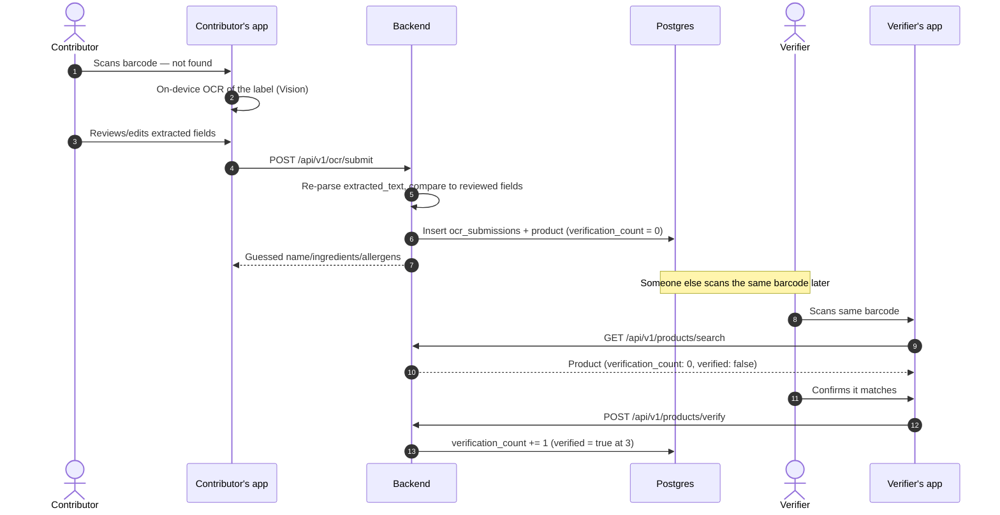

## System overview

```
┌─────────────────────────────┐        ┌─────────────────────────────┐
│         iOS app              │        │          Web apps            │
│  SwiftUI · SwiftData          │        │  Next.js · Turborepo (bun)   │
│  On-device OCR (Vision)       │        │  apps/web (marketing)        │
│  Keychain-held device token   │        │  apps/docs (this site)       │
└───────────────┬───────────────┘        └───────────────────────────────┘
                │ HTTPS, Authorization: Bearer <device token>
                ▼
┌───────────────────────────────────────────────────────────────────┐
│                     Rust backend (Axum + Tokio)                    │
│  routes/ → handlers/ → services/ → models/ · auth.rs · middleware/ │
└──────────┬───────────────────┬───────────────────┬─────────────────┘
           │                   │                   │
           ▼                   ▼                   ▼
     ┌───────────┐       ┌───────────┐       ┌─────────────────┐
     │  Postgres  │       │   Redis    │       │  Open Food Facts │
     │  products, │       │  rate      │       │  (barcode lookup  │
     │  users,    │       │  limits +  │       │  fallback, search  │
     │  verifica- │       │  cache     │       │  top-up)           │
     │  tions,    │       │            │       │                     │
     │  ocr_subs  │       │            │       │                     │
     └───────────┘       └───────────┘       └─────────────────────┘
```

No image storage, no third-party OCR service. Product images are Open Food
Facts' own CDN URLs (`image_url` is a link, nothing is re-hosted). Label OCR
runs **on-device** in the iOS app (Apple's Vision framework, live
multi-frame), not through a cloud vision API — the backend only ever
receives the text the client already extracted, plus what the user
confirmed after reviewing it. See [OCR submission](/docs/backend/api-reference/ocr)
for how the backend cross-checks that against the original text.

## Request flow: scanning a known product

```mermaid
sequenceDiagram
    autonumber
    actor User
    participant iOS
    participant API as Backend
    participant Redis
    participant DB as Postgres
    participant OFF as Open Food Facts

    User->>iOS: Scans barcode
    iOS->>API: GET /api/v1/products/search?barcode=...&country=IN
    API->>Redis: Check cache (1h TTL)
    alt Cache hit
        Redis-->>API: Cached product
    else In Postgres
        API->>DB: Query by (barcode, country)
        DB-->>API: Product row
        API->>Redis: Cache it
    else Neither — ask Open Food Facts
        API->>OFF: Fetch by barcode (rate-limited, 12/min)
        OFF-->>API: Product data
        API->>DB: Insert (source = open_food_facts)
        API->>Redis: Cache it
    end
    API-->>iOS: Product (verified status, nutrient levels, ...)
    iOS->>iOS: Record ScanRecord (SwiftData)
```

## Request flow: a product nobody's added yet



## Design decisions worth knowing

| Decision | Why |
|---|---|
| **Device tokens, not accounts** | No account is required to use the app. A device registers once (`POST /api/v1/auth/device`), gets a bearer token, and that's the identity for everything — verifications, contributions, profile, Plus. Sign in with Apple is additive, not required. See [Authentication](/docs/backend/authentication). |
| **On-device OCR** | Apple's Vision framework runs locally on the phone — no photo or cloud OCR request leaves the device until the user chooses to submit the reviewed text. Cheaper, faster, and it means the backend never handles raw label photos. |
| **Postgres as the source of truth, not a cache of Open Food Facts** | A product fetched from Open Food Facts is written to Postgres and served locally from then on; a periodic refresh (on read, if the local copy is 30+ days stale) keeps OFF-sourced fields in step, but `verified`, `verification_count`, and `lookup_count` are always ours and never overwritten by a refresh. |
| **Fail-open rate limiting** | If Redis is unreachable, requests are allowed through rather than the API going down — the limiter exists to blunt abuse, not to be a single point of failure. |
| **TrueLabel Plus is free right now** | The `users` table and `/me/subscription` endpoints are shaped so a real payment step (App Store Server API, receipt verification) can be added later without changing the response contract — see [Plus / Subscription](/docs/backend/api-reference/me#subscription). |
